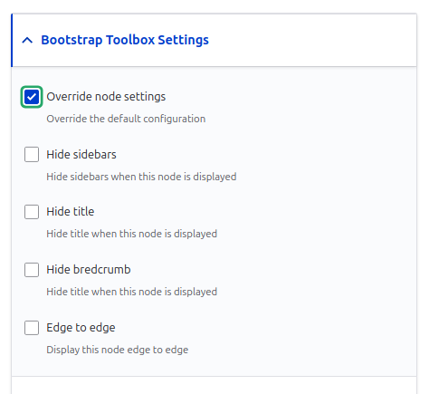
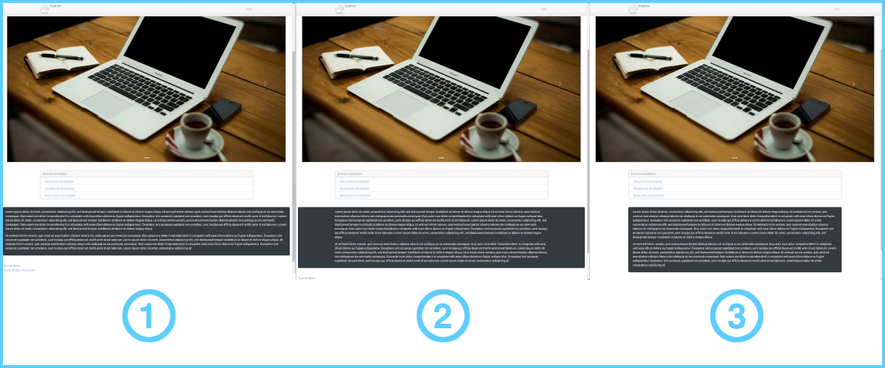

# BOOTSTRAP TOOLBOX 

## Características

freepik

### Control sobre la visualización de la página
Bootstrap Tool Box permite controlar la visualización del título de la página, las barras laterales y el breadcrumb, así como mostrar la página de borde a borde.

Este control se realiza a nivel de tipo de contenido y de nodo. Así se puede establecer que un determinado bundle se muestre de lado a lado, pero un nodo concreto con ese tipo de bundle podrá mostrarse en un contenedor con un tamaño fijo.

El control a nivel de tipo de nodo se realiza mediante cuatro ajustes de ThirdPartySettings (opciones de terceros, disponibles para la entidades de configuración, como los tipos de nodo), mientras que el control en cada nodo se realiza mediante la inclusión en los mismos de cuatro nuevos campos personalizados.

En ambos casos, los nuevos controles se agrupan bajo un contenedor con el título «Bootstrap Toolbox Settings» y son los siguientes 

- Ocultar barras laterales
- Ocultar título
- Ocultar breadcrumb
- Presentar de borde a borde

Además, si existe control a nivel del tipo de nodo (bundle), en el formulario de gestión de los nodos aparece una opción que indica se si desea sobreescribir la configuración general.

### Control sobre la visualización de elementos
  

Hay elementos que necesitan mantenerse con el ancho estándar cuando se muestra la página de borde a borde. Utilizando la terminología de Bootstrap, necesitan mantenerse en un «container» por más que la página se represente en un «container-fluid».

Además, en el caso de que el elemento se represente en un container de ancho limitado, puede interesar que el aspecto del mismo se extienda de borde a borde, tal y como se comprueba en la imagen anterior disponiendo de tres posibilidades:

1. El elemento adopta el ancho de la página y su personalización se extiende de borde a borde.
2. El elemento se encierra en un contenedor de ancho limitado, pero sus personalización se despliega de borde a borde.
3. El elemento se encierra en un contendor de ancho limitado y su personalización afecta a ese contenedor.
 

Para conseguir ese control sobre el ancho de los elementos Bootstrap Toolbox dispone de las siguientes capacidades:

- Añade a la configuración de los bloques dos ajustes para seleccionar el container y añadir clases extra.
- Añade esos mismos ajustes a todos los formateadores de campos, por lo cual en un mismo nodo pueden existir campos con diferente ancho.

### Los inline-blocks de Layout Builder
Los bloques contenidos en la librería de bloques disponen de una configuración adicional en el momento de colocarlos tanto en un nodo gestionado por Layout Builder como en una página mediante el formulario de diseño de bloques.
Es decir, existen por separado el bloque y su modo de presentación, de tal manera que un mismo bloque puede colocarse en dos lugares diferentes y con diferente configuración.
Los inline-blocks creados desde Layout Builder no son reutilizables y no disponen de esa posibilidad, por lo que se ha recurrido a las características del propio bloque.

### Creación y edición de nodos
Con Bootstrap Toolbox se puede alterar el formulario de creación de nodos en el caso de que se utilice el tema del sitio. Resulta extraordinariamente cómodo el eliminar las barras laterales y extender la página de borde a borde para disponer así de espacio.

### Views
Bootstrap Toolbox es capaz de controlar la presentación de las vistas gracias a un conjunto de controles incorporados al formulario de diseño, en el que se puede seleccionar si se elminan las barras laterales, el breadcrumb y el título o si la página se presenta de borde a borde.

### Custom controllers

Las páginas generadas por controladores personalizados también pueden informar a Bootstrap Toolbox sobre sus requerimientos de presentación.
Para ello, deberá personalizarse su ruta editando el router localizado en la raíz de mi_modulo:
<code>
modules/custom/mi_modulo/mi_modulo.routing.yml
</code>

La ruta ha de incluir los parámetros señalados bajo bootstrap_toolbox, con los valores que consideremos convenientes:

<pre>
mi_modulo.mi_ruta:
  path: '/mi/custom/path'
  defaults:
    _title: 'Mi título'
    _controller: '\Drupal\mi_modulo\Controller\MiClassesController'
  requirements:
    _permission: 'access content'
  options:
    bootstrap_toolbox:
      edge_to_edge: FALSE
      hide_sidebars: TRUE
      hide_breadcrumb: TRUE
      hide_title: FALSE
</pre>

## Configuración
La configuración de Bootstrap Toolbar es extremadamente sencilla y está ampliamente explicada en la documentación.
Está listo para utilizar con los principales temas de Bootstrap y puede adaptarse a cualquier otro con un mínimo de trabajo y tiempo.

### Clases, estilos y ámbitos
Los wrappers añadidos por Boostrap Toolbox pueden ser personalizados aplicándose estilos predefinidos creados por los roles a los que se le concedan los permisos adecuados.
Esos estilos pueden estar compuestos por una o varias clases predefinidas de bootstrap e, incluso, por las clases creadas por el administrador del sitio.

Cuando se personalizan los wrappers, mediante un control select, el usuario podrá elegir el estilo a aplicar de una manera muy cómoda e intuitiva, puesto que la asignación de nombre a los estilos es totalmente libre, permitiendo denominaciones descriptivas de su aspecto o función.
Esta posibilidad de elegir un estilo visual se aplica también en las diferentes herramientas proporcionadas por los módulos incluidos en Bootstrap Toolbox.

Para hacer más cómodo el manejo, y no abrumar con un listado de estilos excesivamente poblado, Bootstrap Toolbox define una serie de ámbitos, según el tipo de formateador, de manera que en el control select solo aparecerán los estilos asociados a ese ámbito concreto.

Por último, la gestión de estilos dispone de un asistente que permite seleccionar las clases que compondrán el estilo, pudiendo ver en tiempo real los efectos de añadir o eliminar diferentes clases.

## Módulos incluidos
- [Bootstrap Toolbox Parallas](modules/bootstrap_toolbox_parallax/README.md)
- [Bootstrap Toolbox Block to card](modules/bootstrap_toolbox_block_to_card/README.md)
- [Bootstrap Toolbox List Group](modules/bootstrap_toolbox_list_group/README.md)
- [Bootstrap Toolbox Carousel](modules/bootstrap_toolbox_carousel/README.md)
- ShortCodes -> Temporal, hasta que estén los plugins de CKEditor

Bootstrap Tool Box List Group

- Extiende el formateador de campos label 
- 

- -Ambito de las entidades de classes: bloques, nodos, labels -> filtrar...

Bootstrap Tool Box Carousel

HACER UN TIPO DE CONTENIDO CON PLANTILLA CALL TO ACTION 

## Maintainers

[//]: # cSpell:disable
[//]: # Do not want to add these names, just ignore to the end of this file.
- greenSkin ([greenSkin](https://www.drupal.org/u/greenskin))
- Andrey Troeglazov ([andrey.troeglazov](https://www.drupal.org/u/andreytroeglazov))
- Stephen Mustgrave ([smustgrave](https://www.drupal.org/u/smustgrave))
